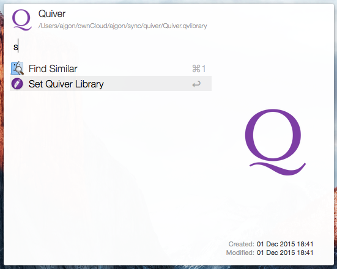
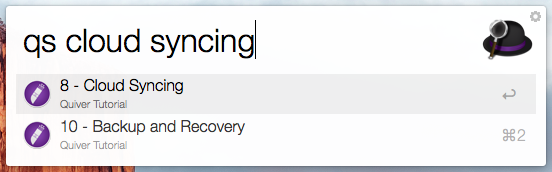

Quiver Search
=============

This is a very basic search, for excellent programmer's notebook: [Quiver](http://happenapps.com/#quiver).

Installation
------------

- Download "[QuiverSearch.alfredworkflow](https://github.com/ajgon/alfred2-quiver-search/blob/master/QuiverSearch.alfredworkflow?raw=true)" extension.
- Double click the downloaded "QuiverSearch.alfredworkflow" file to install. **Alfred 2 is required**

A Little Disclaimer
-------------------

First of all, at the moment, this workflow *does not display the note*, which makes it rather useless. However, it implements proper
Quiver [Note URL](https://github.com/HappenApps/Quiver/issues/97), which should be enabled in the next release. So this extension
would work with it "out-of-the-box", no extra update would be necessary.

Also, at the moment, this tool is very stupid - it splits the query to array of words, and search for notes which contain matches for all of them.
It means, it might get significantly slower, when your notebooks gets larger.
Eventually [@ylian](https://github.com/ylian) (the author of Quiver) would implement a proper [Search API](https://github.com/HappenApps/Quiver/issues/294#issuecomment-162632457) and this extension would move towards it.

Instructions
------------

- First of all, you need to tell the extension, where is your library stored. To do this, selecting it in Alfred Browser,
  and choose "Set Quiver Library" action.

- To do the search, simply invoke the QuiverSearch keyword `qs` followed by the search query. Press enter, to display a note (see above).

License
-------

[MIT](LICENSE)
